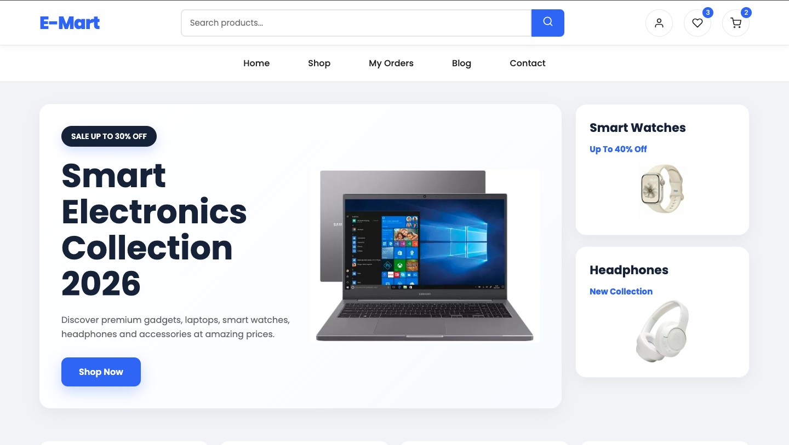
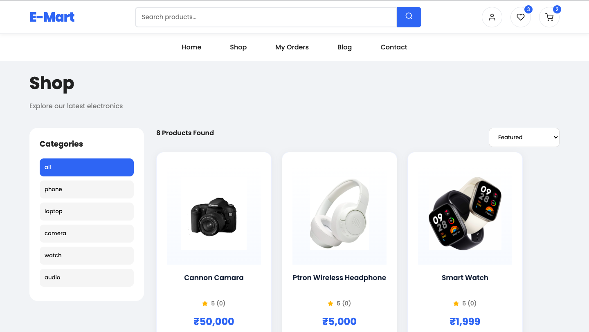
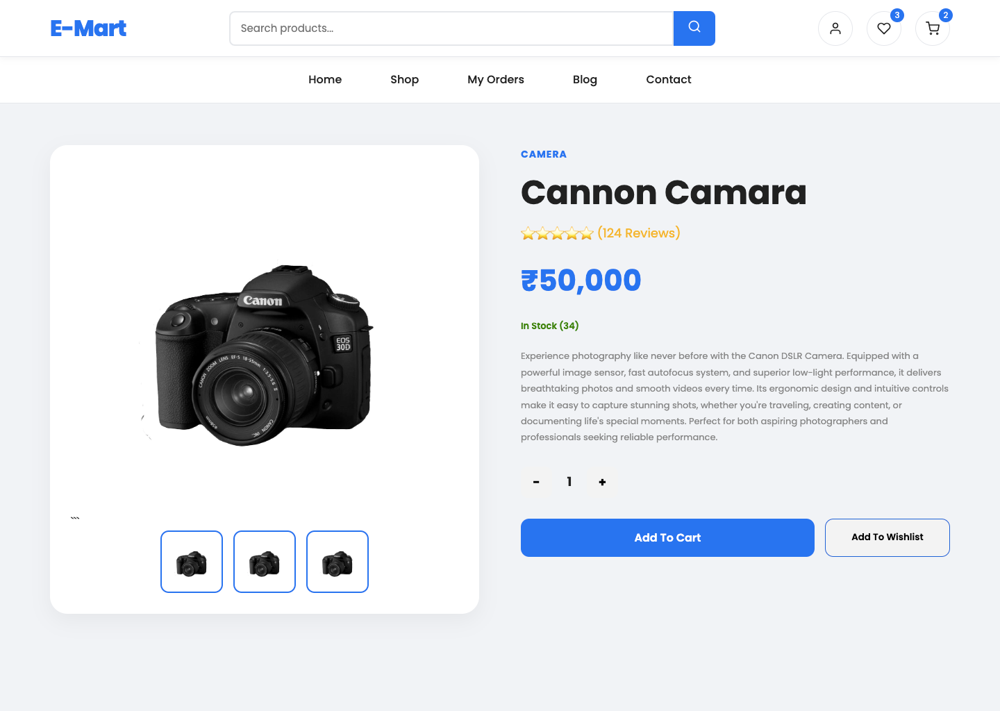
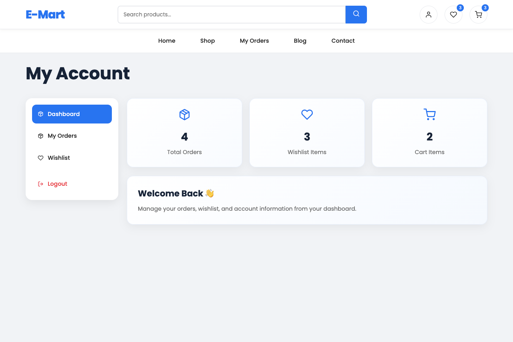
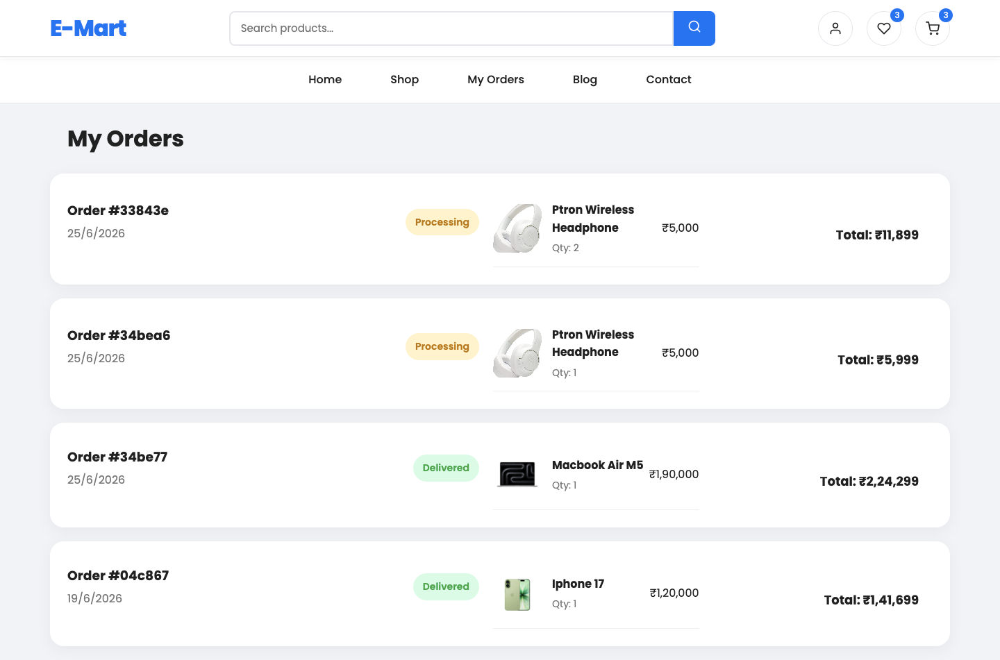
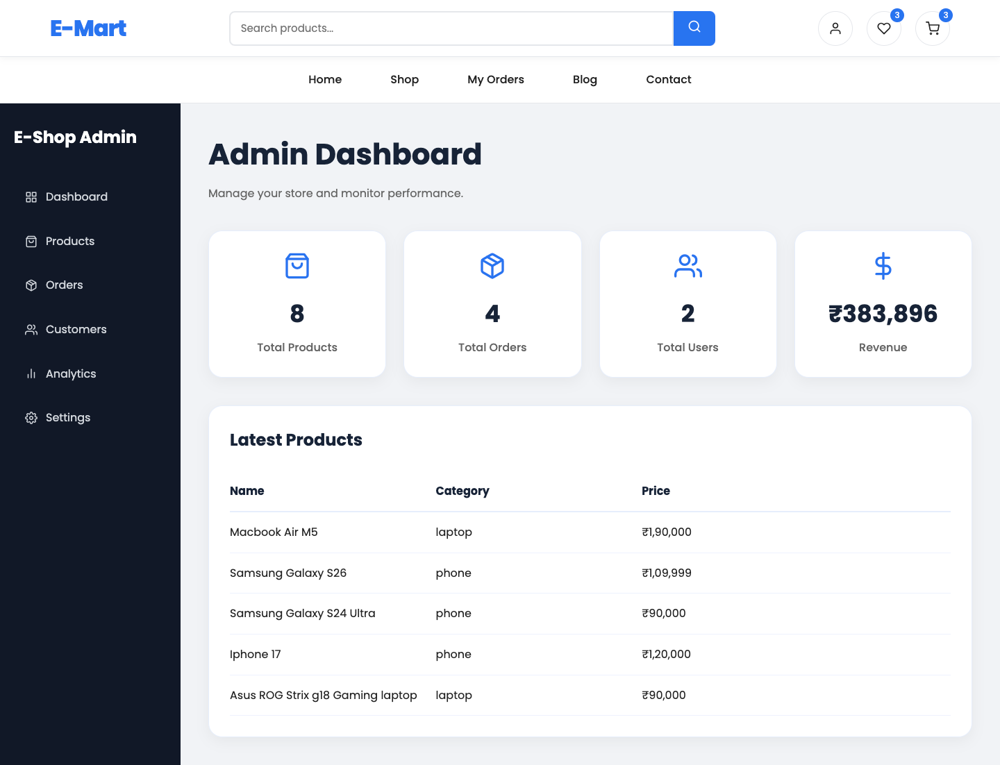
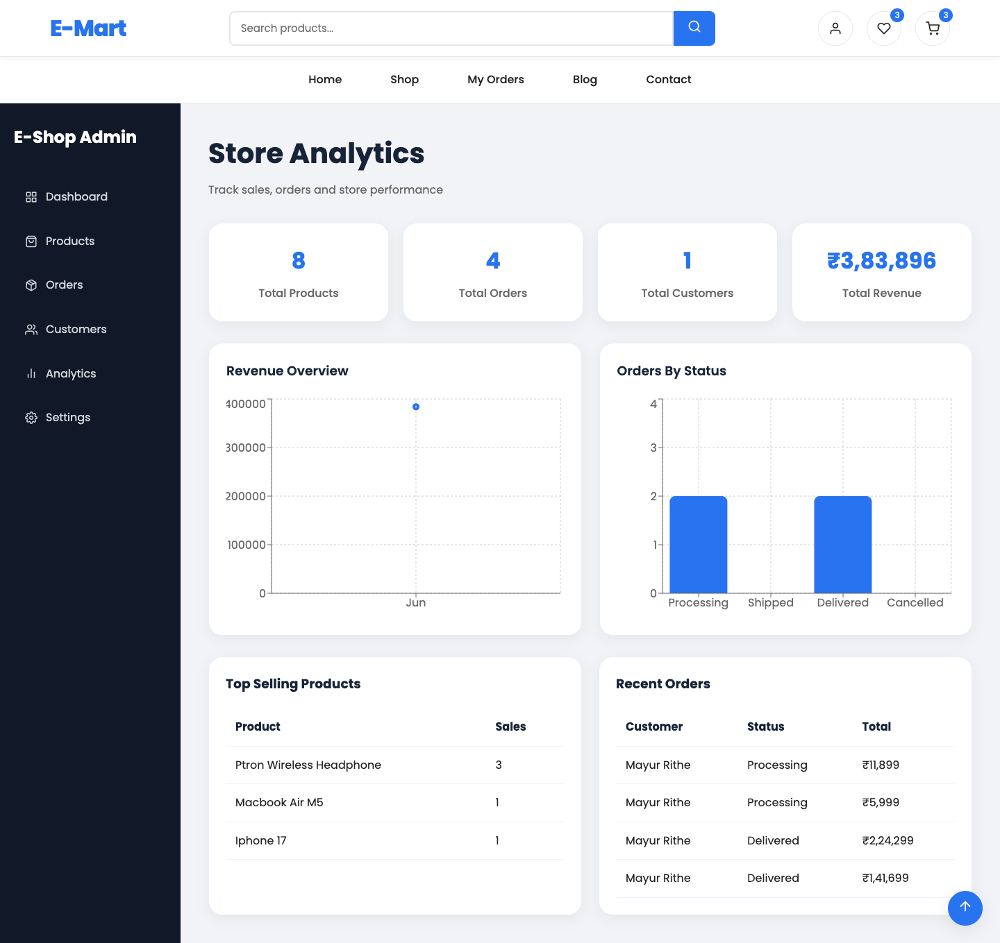

# 🛍️ E-Shop | Full Stack MERN E-Commerce Platform

A modern and fully responsive E-Commerce web application built using the MERN Stack (MongoDB, Express.js, React.js, Node.js).

The platform provides a complete online shopping experience for customers along with a powerful admin panel for managing products, orders, customers, and business analytics.

---

## 🌐 Live Demo

- Live Website: https://e-commerce-website-lnms.onrender.com

---

## 📸 Screenshots

### 🏠 Home Page



---

### 🛍️ Shop Page



---

### 📦 Product Details



---

### 🛒 Shopping Cart


---

### 👤 User Dashboard



---

### 📋 My Orders



---

### ⚙️ Admin Dashboard



---

### 📊 Analytics Dashboard



---

## ✨ Key Features

### Customer Features

- Secure User Authentication (JWT)
- User Registration & Login
- Browse Products
- Product Search Functionality
- Category-Based Filtering
- Product Detail View
- Add Products to Cart
- Update Cart Quantities
- Wishlist Management
- Checkout System
- Order Placement
- Order History Tracking
- Responsive Design for Mobile, Tablet & Desktop

### Admin Features

- Secure Admin Access
- Dashboard Overview
- Product Management
  - Create Products
  - Edit Products
  - Delete Products

- Order Management
  - View Orders
  - Update Order Status
  - Delete Orders

- Customer Insights
- Revenue Analytics
- Order Analytics
- Store Performance Tracking

---

## 📊 Analytics Dashboard

The Admin Analytics Dashboard provides:

- Total Products
- Total Orders
- Total Customers
- Total Revenue
- Monthly Revenue Overview
- Order Status Analytics
- Top Selling Products
- Recent Orders Overview

Built using Recharts for interactive data visualization.

---

## 🛠️ Technology Stack

### Frontend

- React.js
- React Router DOM
- Context API
- Axios
- React Icons
- React Toastify
- Recharts
- CSS3

### Backend

- Node.js
- Express.js
- JWT Authentication
- bcryptjs

### Database

- MongoDB Atlas
- Mongoose

### Deployment

- Render (Frontend)
- Render (Backend)

---

## 📂 Project Structure

### Frontend

```bash
client/
├── public/
├── src/
│   ├── assets/
│   ├── components/
│   ├── context/
│   ├── pages/
│   ├── services/
│   ├── routes/
│   ├── App.jsx
│   └── main.jsx
└── package.json
```

### Backend

```bash
server/
├── config/
├── controllers/
├── middleware/
├── models/
├── routes/
├── server.js
└── package.json
```

---

## 🔑 Environment Variables

### Backend (.env)

```env
PORT=5000

MONGO_URI=YOUR_MONGODB_URI

JWT_SECRET=YOUR_SECRET_KEY

ADMIN_EMAIL=admin@example.com
```

### Frontend (.env)

```env
VITE_API_URL=https://your-api-url.onrender.com/api
```

---

## ⚙️ Installation & Setup

### Clone Repository

```bash
git clone https://github.com/yourusername/mern-ecommerce-store.git

cd mern-ecommerce-store
```

### Backend Setup

```bash
cd server

npm install

npm run dev
```

Backend:

```bash
http://localhost:5000
```

### Frontend Setup

```bash
cd client

npm install

npm run dev
```

Frontend:

```bash
http://localhost:5173
```

---

## 🔒 Authentication & Security

- JWT Authentication
- Protected Routes
- Admin Protected Routes
- Role-Based Access Control
- Password Hashing using bcryptjs

---

## 📦 REST API Endpoints

### Authentication

```http
POST /api/auth/register
POST /api/auth/login
```

### Products

```http
GET    /api/products
GET    /api/products/:id
POST   /api/products
PUT    /api/products/:id
DELETE /api/products/:id
```

### Orders

```http
POST   /api/orders
GET    /api/orders/my-orders
GET    /api/orders
PUT    /api/orders/:id
DELETE /api/orders/:id
```

---

## 📱 Responsive Design

Optimized for:

- Desktop Devices
- Tablets
- Mobile Devices

---

## 🔮 Future Enhancements

- Razorpay Integration
- Stripe Integration
- Product Reviews & Ratings
- Email Notifications
- Coupon System
- Inventory Management
- Sales Report Export
- Dark Mode
- Multi-Vendor Marketplace

---

## 👨‍💻 Developer

Mayur Rithe

MERN Stack Developer

### Skills

- MongoDB
- Express.js
- React.js
- Node.js
- REST APIs
- JWT Authentication
- Context API
- Recharts
- Responsive UI Design

---

## ⭐ If you like this project

Give this repository a star and feel free to fork it.
